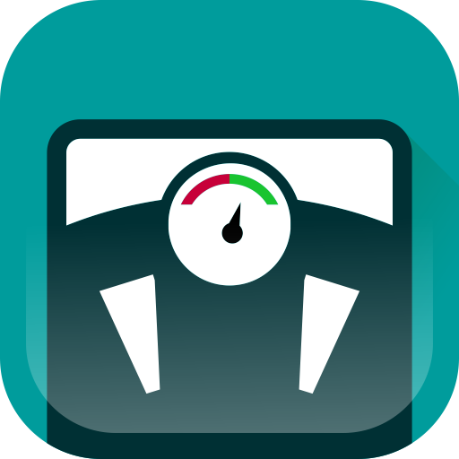
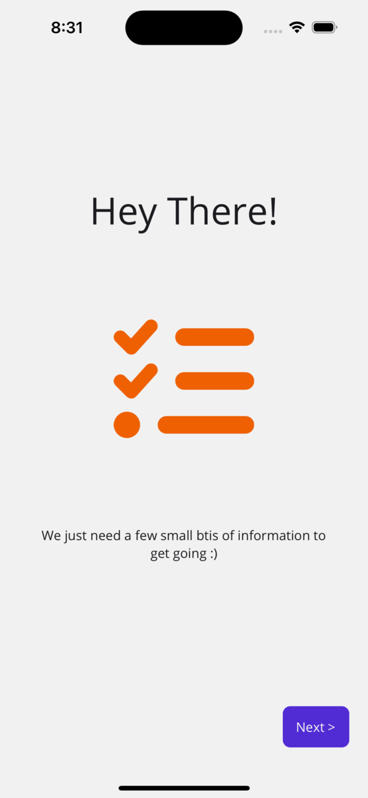
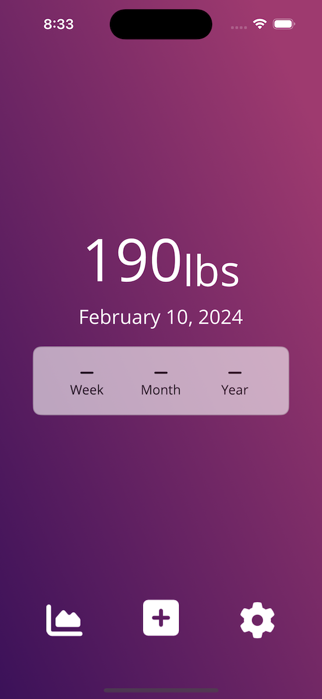
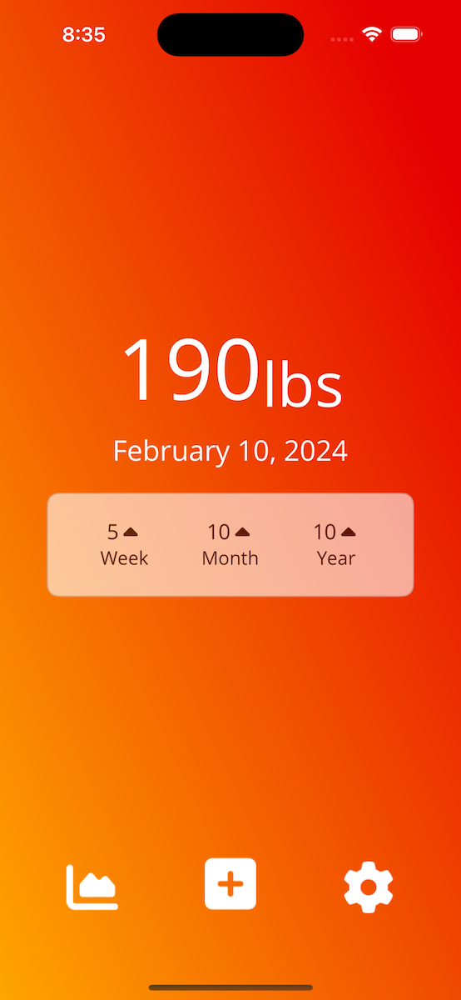
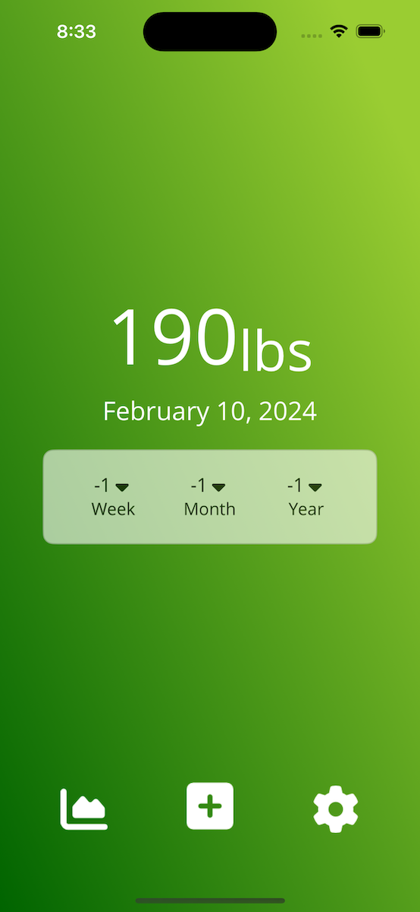
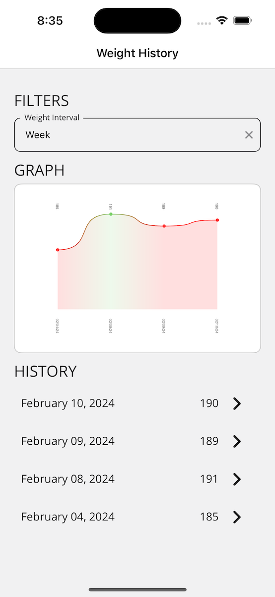
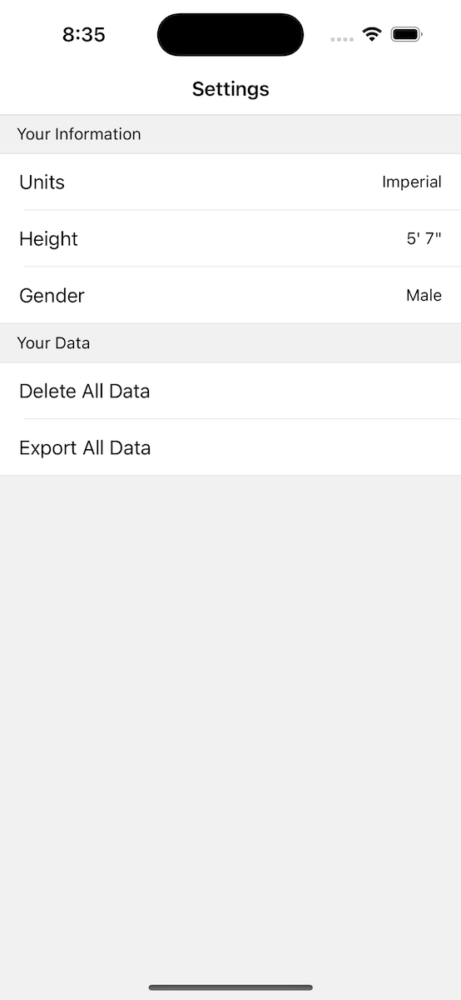

# .NET MAUI Weight Tracker App

Welcome to the .NET MAUI Weight Tracker App, an open-source project showcasing the power and elegance of .NET MAUI for building good looking cross-platform applications. My goal is to demonstrate that you can build a fully functional and visually appealing app using .NET MAUI, backed by a SQLite local database for robust data management.

## Features

- **Current Weight and Progress Display:** A beautifully designed homepage that not only shows your current weight but also visualizes your progress over time.
- **Weight History:** Dive into your weight history with a dedicated page that outlines your journey, helping you stay motivated and informed.
- **Local Data Storage:** Utilizes a SQLite database to store and retrieve your weight data securely and efficiently, ensuring your data remains private and accessible across sessions.

## Screenshots

### Welcome Screen

### Homescreen

The background color changes based on your weight gain and loss

### Graph and history page

### Settings Page

## Technologies Used

- [.NET MAUI](https://github.com/dotnet/maui): The latest framework for building cross-platform applications for Android, iOS, macOS, and Windows with a single codebase.
- [SQLite](https://www.sqlite.org/index.html): A C-language library that implements a small, fast, self-contained, high-reliability, full-featured, SQL database engine.
- [NET MAUI Community Toolkit](https://github.com/CommunityToolkit/Maui): A collection of reusable elements for mobile and desktop development with .NET MAUI, including converters, behaviors, and effects to speed up development and enhance app capabilities.
- [CommunityToolkit.Mvvm](https://github.com/CommunityToolkit/dotnet): An MVVM (Model-View-ViewModel) toolkit that simplifies the implementation of the MVVM pattern in .NET applications, providing advanced features like observable properties, commands, and messaging that make developing responsive, testable apps easier.
- [AiForms.Maui.SettingsView](https://github.com/muak/AiForms.Maui.SettingsView): A library for easily adding settings views to your .NET MAUI app, allowing for the creation of rich, customizable settings screens without extensive UI coding.
- [UraniumUI.Material](https://github.com/enisn/UraniumUI): A .NET MAUI library that brings Material Design components and styles to your app, helping create a modern, visually appealing interface with Material Design principles.
- [Microcharts.Maui](https://github.com/microcharts-dotnet/Microcharts): A versatile charting library for .NET MAUI that enables the integration of beautiful and interactive charts into your app, perfect for displaying data and progress in a visually engaging way.
- [SkiaSharp](https://github.com/mono/SkiaSharp): A powerful 2D graphics library for .NET that allows for the creation of complex and high-performance drawings and animations, used in conjunction with .NET MAUI to enhance the app's visual elements and charting capabilities.
- MVVM Architecture: Leveraging the Model-View-ViewModel (MVVM) pattern to promote a clean separation of concerns and easier maintenance.

## Getting Started

To get started with this project, ensure you have the .NET 8 SDK and with the .NET MAUI workload.

1. Clone this repository to your local machine.

2. Open the solution file (.sln) in Visual Studio or use Visual Studio Code with the .Net MAUI extensions.

3. Use Visual Studio's built-in tools to build and run the application on your chosen platform (Android, iOS, macOS, Windows).

## Support

If you have any questions, encounter bugs, or need assistance using Weight Tracker, please feel free to open an issue on our GitHub Issues page. We welcome your feedback and contributions to help improve Weight Tracker.

For more detailed questions or discussions, consider using the Issues section on the GitHub repository. This is a great place to share ideas, ask for help with more complex issues, or discuss potential features.

## Contribution

We welcome contributions to Weight Tracker. You can contribute by forking the repository, making your changes, and submitting a pull request. For more detailed instructions.

## License

Weight Tracker is open-sourced software licensed under the MIT license.